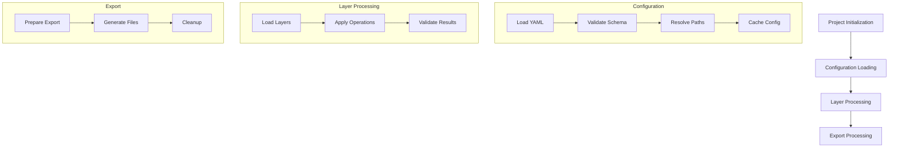
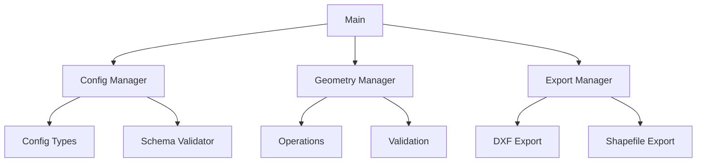

# System Architecture

## Overview
This document describes the system architecture of the Python ACAD Tools project, detailing the core components, their relationships, and the processing pipeline.

## Related Documents
- [Code Quality](../guidelines/CODE_QUALITY.md) - Implementation standards
- [Integration](../guidelines/INTEGRATION.md) - Component integration patterns
- [Index](../INDEX.md) - Documentation navigation

## Version Applicability
- Python Version: 3.12+
- Last Updated: 2024-02-22
- Status: Draft

## Core Design Principles

1. **Clear Separation of Concerns**
   - Each component has a single, well-defined responsibility
   - Components communicate through well-defined interfaces
   - Dependencies are explicit and minimized

2. **Type Safety**
   - Strong typing throughout the system
   - Type validation at component boundaries
   - Custom types for domain-specific concepts

3. **Component Independence**
   - Components can be tested in isolation
   - Minimal coupling between components
   - Clear dependency hierarchy

## System Components

### 1. Core Component
- Configuration management
- Resource management
- Error handling
- Logging system
- Type system

### 2. Configuration System
- YAML configuration loading
- JSON Schema validation
- Configuration caching
- Path resolution
- Cross-reference validation

### 3. Geometry Processing
- Layer management
- Operation framework
- Processing pipeline
- Validation system
- Drawing components

### 4. Export System
- DXF export
- Shapefile export
- Web service integration
- Export validation
- Resource cleanup

## Project Structure
```
src/
├── config/                 # Configuration management
│   ├── schemas/           # JSON validation schemas
│   ├── types.py          # Configuration types
│   └── config_manager.py # Main config manager
├── core/                  # Core functionality
│   ├── errors.py         # Error types
│   ├── logging.py        # Logging system
│   └── resources.py      # Resource management
├── geometry/              # Geometry processing
│   ├── operations/       # Geometry operations
│   ├── validation/       # Geometry validation
│   └── manager.py        # Geometry manager
├── export/                # Export system
│   ├── dxf/             # DXF export
│   ├── shapefile/       # Shapefile export
│   └── manager.py        # Export manager
└── main.py               # CLI entry point
```

## Processing Pipeline



## Component Dependencies



## Error Handling

### Error Hierarchy
```python
class PycadError(Exception):
    """Base error for all Pycad exceptions"""

class ConfigError(PycadError):
    """Configuration-related errors"""

class GeometryError(PycadError):
    """Geometry processing errors"""

class ExportError(PycadError):
    """Export-related errors"""
```

### Error Propagation
1. Errors are caught at component boundaries
2. Errors are logged with context
3. Errors are propagated to appropriate level
4. User-facing errors are formatted clearly

## Resource Management

### Resource Lifecycle
1. Resource acquisition in initialization
2. Resource validation before use
3. Resource cleanup on completion
4. Error handling for cleanup failures

### Caching Strategy
1. Configuration caching
2. Geometry result caching
3. Export template caching
4. Cache invalidation rules

## Performance Considerations

### Processing Optimization
1. Parallel processing where possible
2. Efficient geometry algorithms
3. Memory management for large datasets
4. Export optimization strategies

### Resource Usage
1. Memory footprint monitoring
2. File handle management
3. Network resource management
4. Temporary file cleanup
